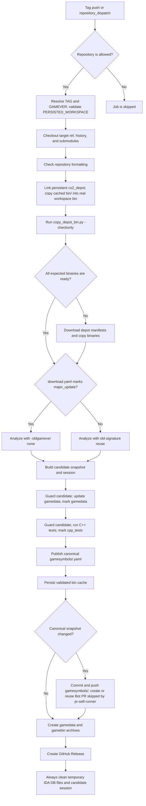

# build-on-self-runner

## Overview
`.github/workflows/build-on-self-runner.yml` 是正式版本构建与发布流水线：在受信任的 Windows self-hosted runner 上准备指定 CS2 版本的二进制，执行 IDA 分析，生成并验证候选 game-symbol snapshot，随后持久化缓存、创建 snapshot PR、打包并发布 Release。

## Responsibilities
- 响应 tag push 或 `repository_dispatch: build-on-self-runner`，解析并校验 `TAG` / `GAMEVER`。
- 复用 `PERSISTED_WORKSPACE` 中的 depot 和二进制缓存，缺失时下载对应 depot 并复制目标二进制。
- 根据 `download.yaml` 的 `major_update` 标记决定是否禁用旧版本 signature 复用，然后运行二进制分析。
- 构建单一候选 snapshot，让 gamedata 更新和 C++ 测试消费同一个不可变候选，并通过 session guard/mark 记录验证状态。
- 将通过验证的候选发布为 `gamesymbols/<GAMEVER>.yaml`，持久化已验证的二进制缓存。
- snapshot 变化时创建或复用后续 PR；该 Bot `gamesymbols/<GAMEVER>` PR 会被 `pr-self-runner` 显式跳过。随后生成 `gamedata-<GAMEVER>.7z`、`gamebin-<GAMEVER>.7z` 和 GitHub Release。
- 无论成功或失败，清理候选 session 和持久化目录中的临时 IDA 数据库文件。

## Involved Files & Symbols
- `.github/workflows/build-on-self-runner.yml` - workflow `Build On Self Runner` / job `build`
- `download.yaml` - `downloads[].tag` / `major_update` / depot manifests
- `config.yaml` - 二进制模块、symbol skill 与 C++ 测试配置
- `download_depot.py` - 按 tag 下载 depot manifests
- `copy_depot_bin.py` - `-checkonly` 缓存检查与 depot 二进制复制
- `ida_analyze_bin.py` - 二进制分析与 signature 生成
- `gamesymbol_candidate.py` - `build` / `guard` / `mark` / `publish`
- `update_gamedata.py` - 从候选 snapshot 更新下游 gamedata
- `run_cpp_tests.py` - 从候选 snapshot 执行 C++ 编译与布局验证
- `gamesymbols/<GAMEVER>.yaml` - 通过验证后发布的 canonical snapshot
- `tests/test_build_self_runner_workflow.py` - 工作区、候选顺序、snapshot PR 与归档约束测试
- `tests/test_pr_self_runner_workflow.py` - 两个 workflow 的 C++ 测试失败传播约束

## Architecture
大致流程：

1. 由 tag push 或 repository dispatch 触发；仅允许 `HLND2T/CS2_VibeSignatures` 与 `hzqst/CS2_VibeSignatures`。
2. tag push 使用 `github.ref_name`，dispatch 使用 `client_payload.tag`；校验 `PERSISTED_WORKSPACE` 后设置 `TAG`、`GAMEVER`、`WORKSPACE`。
3. checkout 目标 ref、完整历史与 submodules，并执行仓库格式检查。
4. 将工作区 `cs2_depot` 链接到持久化 depot；工作区 `bin` 必须是真实目录。若持久化 `bin/<GAMEVER>` 已存在，先复制进本次工作区。
5. 用 `copy_depot_bin.py -checkonly` 检查所有预期二进制。缓存完整则跳过下载；缺失则运行 `download_depot.py` 和正常复制模式。
6. 查询 `download.yaml`：`major_update: true` 时为分析命令追加 `-oldgamever none`，强制新建 signatures；否则允许复用旧版本结果。
7. IDA 分析完成后，在 `RUNNER_TEMP` 中构建候选 snapshot 与 session。
8. 对同一候选依次执行 gamedata 更新和 C++ 测试；每个阶段前后都 guard，成功后分别 mark `gamedata` 与 `cpp_tests`。
9. publish 将已验证候选写入 `gamesymbols/<GAMEVER>.yaml`；之后才把工作区二进制复制回持久化缓存。
10. canonical snapshot 若发生变化，则在 `gamesymbols/<GAMEVER>` 分支提交并 force-with-lease 推送，按需创建后续 PR；`pr-self-runner` 通过 Bot 身份、分支前缀和标题前缀显式跳过此类 PR。
11. 生成 gamedata 与纯 gamebin 两类 7z 包，并以当前 tag 创建 GitHub Release。
12. `always()` 清理持久化缓存中的临时 IDA DB 文件以及候选 session 目录。

## Dependencies
- GitHub Actions `win64` environment，以及标签为 `self-hosted`, `windows`, `x64` 的 runner。
- Secrets：`PERSISTED_WORKSPACE`、Steam 凭证，以及 `CS2VIBE_AGENT` / LLM 配置。
- GitHub Actions / CLI：`actions/checkout@v4`、`softprops/action-gh-release@v1`、`gh`、`git`。
- Windows 工具：PowerShell、`robocopy`、`mklink`、7-Zip。
- 分析与验证工具链：`uv`、Python、DepotDownloader、IDA / idalib-mcp、LLM agent、Clang/C++。
- 配置与缓存：`download.yaml`、`config.yaml`、`PERSISTED_WORKSPACE/cs2_depot`、`PERSISTED_WORKSPACE/bin/<GAMEVER>`。
- 相关 Serena memory：`mem:download_depot`、`mem:copy_depot_bin`、`mem:ida_analyze_bin`、`mem:update_gamedata`、`mem:run_cpp_tests`。

## Notes
- workflow 拥有 `contents: write` 与 `pull-requests: write`；这是发布 Release、推送 snapshot 分支和创建 PR 所必需的。
- 工作区 `cs2_depot` 可以是指向持久化目录的 link，但工作区 `bin` 明确要求为真实目录，避免分析过程直接污染共享缓存。
- 持久化已验证 bin 前会删除目标内的 `*.yaml`，canonical symbol 数据只由 `gamesymbols/<GAMEVER>.yaml` 表示，而不是持久化 bin 内的中间 YAML。
- gamedata 与 C++ 测试必须读取同一个 `ACTUAL_CANDIDATE_SNAPSHOT`，不能回退到 `bin` 中的可变 YAML；publish 发生在两个验证阶段之后。
- `copy_depot_bin.py -checkonly` 的退出码契约为：0 表示完整、1 表示缺失、其他值视为错误。
- snapshot 无变化时不会创建后续 PR；已有同 head 分支的 open PR 时也不会重复创建。自动 snapshot PR 使用 `gamesymbols/` 分支和 `chore(gamesymbols): add ` 标题，匹配 `pr-self-runner` 的显式 Bot 排除条件。
- `git push --force-with-lease` 会更新按版本复用的 snapshot 分支，因此该分支不是永久追加历史。
- release payload 分为两类：gamedata 包排除 DLL/SO 与 IDA 临时文件，gamebin 包只包含 DLL/SO 且排除 YAML。
- 清理步骤使用 `always()`；但只有前置步骤成功时才会执行归档、Release 与 snapshot PR 创建。

## Callers
- GitHub tag push：`push.tags: ["*"]`
- GitHub repository dispatch：`repository_dispatch.types: [build-on-self-runner]`，tag 来自 `client_payload.tag`
