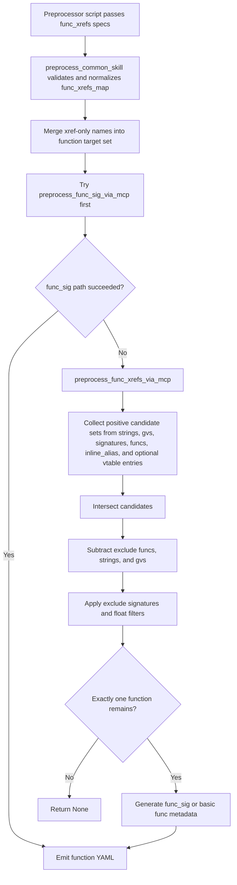

# func_xrefs

## Overview
`func_xrefs` is the dict-based xref fallback configuration consumed by `preprocess_common_skill` for function targets. It is used when direct `func_sig` relocation fails, and it can also be the only lookup path for functions that appear only in the `func_xrefs` list.

## Responsibilities
- Define one normalized xref-resolution spec per target function through `func_name` plus validated list fields.
- Register xref-only function targets so they still enter the normal function output pipeline.
- Control when xref-based fast-path probing is allowed before YAML-backed dependencies are ready.
- Drive candidate intersection and exclusion logic through `preprocess_func_xrefs_via_mcp`.

## Involved Files & Symbols
- `ida_analyze_util.py` - `preprocess_common_skill`
- `ida_analyze_util.py` - `_build_target_kind_map`
- `ida_analyze_util.py` - `_try_preprocess_func_without_llm`
- `ida_analyze_util.py` - `_can_probe_future_func_fast_path`
- `ida_analyze_util.py` - `preprocess_func_xrefs_via_mcp`
- `ida_analyze_util.py` - `_collect_xref_func_starts_for_string`
- `ida_analyze_util.py` - `_collect_xref_func_starts_for_signature`
- `ida_analyze_util.py` - `_filter_func_addrs_by_signature_via_mcp`
- `ida_analyze_util.py` - `_filter_func_addrs_by_float_xrefs_via_mcp`
- `ida_analyze_util.py` - `_normalize_float_xref_values`
- `ida_analyze_util.py` - `_collect_single_call_or_jump_xref_func_starts_for_ea`
- `tests/test_ida_analyze_util.py` - xref/signature/vtable/float filter coverage for the contract
- `tests/test_ida_preprocessor_scripts.py` - script-level forwarding coverage for `func_xrefs`

## Architecture
`func_xrefs` starts as a list of dict specs passed into `preprocess_common_skill`. That function validates the allowed keys, normalizes every list field, rejects duplicate targets and empty positive-source specs, then stores the result in `func_xrefs_map`. The target names from that map are merged into the function target set, so a symbol can be generated even when it is absent from `func_names`.

When a function is processed, `_try_preprocess_func_without_llm` first attempts `preprocess_func_sig_via_mcp`. If that fails and the function has a `func_xrefs` spec, it falls back to `preprocess_func_xrefs_via_mcp`. `_can_probe_future_func_fast_path` is checked earlier for LLM-assisted flows so that YAML-backed `xref_funcs` / symbolic `xref_gvs` dependencies are not probed before their current-version YAML files exist.

`preprocess_func_xrefs_via_mcp` builds positive candidate sets from `xref_strings`, `xref_gvs`, `xref_signatures`, `xref_funcs`, `inline_alias`, and optional `vtable_class` entries. It intersects those sets, subtracts `exclude_funcs`, `exclude_strings`, and `exclude_gvs`, then applies `exclude_signatures` and readonly scalar float filters. The result must collapse to exactly one function start before YAML data is emitted.

## Dependencies
- Internal helpers: `_build_target_kind_map`, `_try_preprocess_func_without_llm`, `_can_probe_future_func_fast_path`, `_collect_xref_func_starts_for_string`, `_collect_xref_func_starts_for_ea`, `_collect_xref_func_starts_for_signature`, `_filter_func_addrs_by_signature_via_mcp`, `_filter_func_addrs_by_float_xrefs_via_mcp`, `_load_symbol_addr_from_current_yaml`, `_load_gv_or_explicit_ea`, `preprocess_gen_func_sig_via_mcp`
- MCP tools used by the underlying flow: `py_eval` for string/float inspection and `find_bytes` for signature search
- Artifact dependencies: current-version `*.{platform}.yaml` files for `func_va` / `gv_va`, plus optional `*_vtable.{platform}.yaml`

## Notes
- Only dict-style specs are accepted now; the older tuple schema is rejected.
- Supported keys are `func_name`, `xref_strings`, `xref_gvs`, `xref_signatures`, `xref_funcs`, `inline_alias`, `xref_floats`, `exclude_funcs`, `exclude_strings`, `exclude_gvs`, `exclude_signatures`, and `exclude_floats`.
- At least one positive source among `xref_strings`, `xref_gvs`, `xref_signatures`, `xref_funcs`, and `inline_alias` is required. `xref_floats` and `exclude_floats` are post-intersection filters, not positive candidate sources.
- `inline_alias` is a string naming a well-known function that must have a current-version YAML. It uses `_collect_single_call_or_jump_xref_func_starts_for_ea` to find functions containing exactly one call or jump to the alias — targeting thunk/wrapper patterns. If no single-call caller exists, the alias function address itself becomes the sole candidate (covering the case where the target is the alias function inlined directly). Unlike `xref_funcs` which collects all callers regardless of call count, `inline_alias` is stricter: only functions with a single call/jump to the alias qualify.
- `xref_strings` uses substring matching by default; the `FULLMATCH:` prefix switches a string entry to exact matching.
- `xref_signatures` first probes within already narrowed candidates when the candidate set is small enough; otherwise it falls back to a global `find_bytes` search.
- Symbolic `xref_gvs` / `exclude_gvs` and all `xref_funcs` / `exclude_funcs` require current-version YAML artifacts in `new_binary_dir`. Explicit `0x...` gv addresses bypass that YAML lookup.
- When a dependency function has no callers, `xref_funcs` can still contribute a candidate if that function address is present in the selected vtable entry set.
- Float filters only inspect scalar SSE/AVX instructions that read readonly `.rdata` / `.rodata` constants, and non-finite float values are rejected during normalization.
- The xref pipeline is fail-closed: invalid normalization, missing required dependency artifacts, helper probe failures, or non-unique final candidates all return `None`.

## Callers
- `_try_preprocess_func_without_llm` in `ida_analyze_util.py`
- `preprocess_common_skill` in `ida_analyze_util.py`
- preprocessor entry scripts under `ida_preprocessor_scripts/find-*.py`, which pass `func_xrefs` specs into `preprocess_common_skill`
