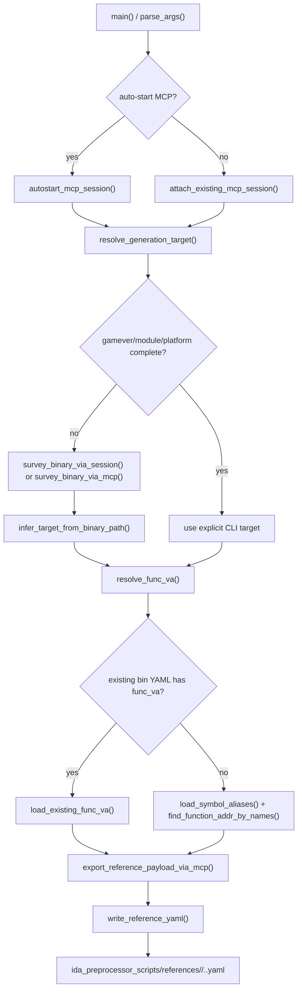

# generate_reference_yaml

## Overview
`generate_reference_yaml.py` is a standalone CLI that generates reference YAML files at `ida_preprocessor_scripts/references/<module>/<func_name>.<platform>.yaml` for `LLM_DECOMPILE` workflows. It resolves the target binary context, finds a stable function VA, then uses IDA MCP `py_eval` to export disassembly plus optional Hex-Rays pseudocode before writing a minimal YAML payload.

## Responsibilities
- Parse CLI arguments, enforce `-binary` / `-auto_start_mcp` pairing, and infer missing `gamever` / `module` / `platform` from the current IDA binary when possible.
- Resolve function VA by preferring existing `bin/<gamever>/<module>/<func_name>.<platform>.yaml` metadata, otherwise loading symbol aliases from `configs/<GAMEVER>.yaml` and querying IDA names.
- Manage MCP connection modes (attach existing MCP or auto-start `idalib-mcp`), export `func_name` / `func_va` / `disasm_code` / `procedure`, validate payload shape, and persist the output YAML.

## Involved Files & Symbols
- `generate_reference_yaml.py` - `parse_args`, `resolve_generation_target`, `resolve_func_va`, `find_function_addr_by_names`, `export_reference_payload_via_mcp`, `run_reference_generation`, `main`
- `generate_reference_yaml.py` - `_open_mcp_session`, `attach_existing_mcp_session`, `autostart_mcp_session`, `_load_ida_analyze_bin`
- `configs/<GAMEVER>.yaml` - `modules[].symbols[].name` and `modules[].symbols[].alias` consumed by `load_symbol_aliases`
- `README.md` - `Prepare reference YAML for LLM_DECOMPILE` usage section documents the CLI contract and output expectations
- `tests/test_generate_reference_yaml.py` - imports the module and verifies orchestration order / CLI behavior

## Architecture
The module is structured as a thin CLI orchestrator plus small helper layers:
- Input normalization / validation: `_normalize_non_empty_text`, `_normalize_address_text`, `_validate_reference_yaml_payload`
- Target inference: `resolve_generation_target` fills missing CLI fields from IDA survey metadata and `infer_target_from_binary_path`
- Function address resolution: `resolve_func_va` first reads current-version YAML, then falls back to `configs/<GAMEVER>.yaml` aliases + IDA name lookup
- MCP export: `export_reference_payload_via_mcp` runs `py_eval` inside IDA to gather disassembly and optional decompiled pseudocode
- Session lifecycle: `_open_mcp_session` handles HTTP MCP setup; attach and auto-start modes wrap it with health check / process lifecycle management
- Output: `write_reference_yaml` writes a minimal ordered YAML mapping using `LiteralDumper`



## Dependencies
- Python libraries: `yaml`, optional `httpx`, `mcp.ClientSession`, `mcp.client.streamable_http.streamable_http_client`
- Internal helpers: `ida_analyze_util.parse_mcp_result`, `ida_analyze_bin` wrappers for MCP health checks, binary survey, and `idalib-mcp` lifecycle
- Repository data: `configs/<GAMEVER>.yaml`, `bin/<gamever>/<module>/<func_name>.<platform>.yaml`, output directory `ida_preprocessor_scripts/references/`
- IDA-side APIs invoked through `py_eval`: `ida_funcs`, `ida_name`, `idaapi`, `ida_lines`, `ida_segment`, `idautils`, `idc`, optional `ida_hexrays`

## Notes
- Target inference assumes the surveyed binary path contains `/bin/<gamever>/<module>/<binary>`; otherwise missing CLI fields become a hard error.
- Alias-based address lookup is intentionally strict: no candidate match or more than one distinct `func_va` both raise `ReferenceGenerationError`.
- Output YAML is intentionally minimal and validated; only `func_name`, `func_va`, `disasm_code`, and `procedure` are persisted.
- `procedure` is allowed to be an empty string when Hex-Rays is unavailable or decompilation fails.
- In auto-start mode, the script always attempts graceful MCP / IDA shutdown in a `finally` block.
- The exported `func_name` stays aligned with the user-requested canonical symbol name, even if the underlying IDA function name differs.

## Example yamls
Observed reference YAMLs keep the same top-level field order: `func_name`, `func_va`, `disasm_code`, `procedure`.

```yaml
func_name: CEngineServiceMgr__MainLoop
func_va: '0x18021cbf0'
disasm_code: |-
  .text:000000018021CBF0                 mov     rax, rsp
procedure: |-
  __int64 __fastcall CEngineServiceMgr__MainLoop(__int64 a1, double a2)
```

- `ida_preprocessor_scripts/references/engine/CEngineServiceMgr__MainLoop.windows.yaml` - representative Windows `engine` sample with long disassembly and non-empty pseudocode.
- `ida_preprocessor_scripts/references/engine/CEngineServiceMgr__MainLoop.linux.yaml` - Linux counterpart of the same logical symbol; confirms cross-platform output keeps the same four-field schema.
- `ida_preprocessor_scripts/references/networksystem/CNetChan_ParseMessagesDemo.windows.yaml` - `networksystem` sample where `procedure` starts after a relatively short disassembly block.
- `ida_preprocessor_scripts/references/client/CLoopModeGame_ReceivedServerInfo.windows.yaml` - `client` sample whose `procedure` begins with a multiline function signature.
- `ida_preprocessor_scripts/references/server/CBaseEntity_Spawn.windows.yaml` - `server` sample with a compact `void`-returning pseudocode body.

## Callers (optional)
- `README.md` and `README_CN.md` document direct CLI invocation via `uv run generate_reference_yaml.py ...`
- `tests/test_generate_reference_yaml.py` imports `generate_reference_yaml` and exercises `run_reference_generation(...)` / `main()`
