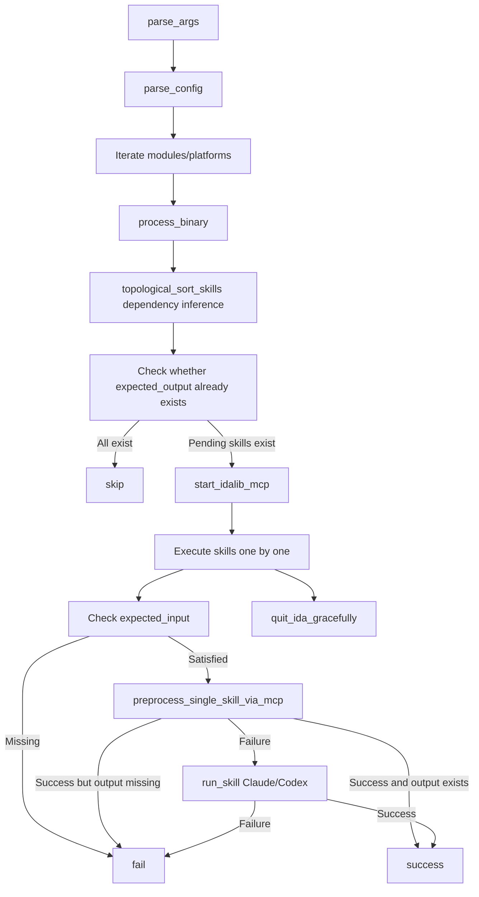

# ida_analyze_bin

## Overview
`ida_analyze_bin.py` is the main CLI entry point for CS2 binary analysis. It parses runtime arguments and environment-variable fallbacks, builds the module/platform/LLM execution context, and drives the overall `preprocess -> Agent fallback -> optional rename/comment post-process` flow; `README.md` documents common invocation patterns and part of the environment configuration.

## Responsibilities
- Parse CLI arguments and derive runtime fields: `platforms`, `module_filter`, `vcall_finder_filter`, `oldgamever`, `llm_temperature`, `llm_fake_as`, and `llm_effort`.
- Read module and skill definitions from `configs/<GAMEVER>.yaml`, iterate binaries by module and platform, and run preprocessing, Agent fallback, and aggregated statistics.
- Start, keep alive, restart, and gracefully shut down `idalib-mcp`, and run `vcall_finder` aggregation and `-rename` post-processing when needed.

## Involved Files & Symbols
- `ida_analyze_bin.py` - `parse_args`
- `ida_analyze_bin.py` - `resolve_oldgamever`
- `ida_analyze_bin.py` - `_is_major_update_gamever`
- `ida_analyze_bin.py` - `parse_vcall_finder_filter`
- `ida_analyze_bin.py` - `start_idalib_mcp`
- `ida_analyze_bin.py` - `process_binary`
- `ida_analyze_bin.py` - `main`
- `README.md` - `ida_analyze_bin.py` command examples, `-llm_*` parameter documentation, and IDA preprocessor environment variable notes
- `configs/<GAMEVER>.yaml` - module and skill metadata input
- `ida_skill_preprocessor.py` - downstream preprocessing stage used by `process_binary`

## Architecture
The main entry still follows the layered workflow recorded in the previous memory version: `main -> process_binary -> (preprocess/run_skill)`. `parse_args()` provides the CLI/environment-variable context, while `README.md` supplements common invocation patterns and downstream environment conventions.

Key implementation points:
- `topological_sort_skills` builds an index by `expected_output -> producer`, then reverse-maps each skill's `expected_input` to producers to infer dependencies.
- Dependency matching first uses normalized full path (`normpath + normcase`), and falls back to filename matching (`basename`) if full-path match fails.
- `prerequisite` is still read and merged into the dependency graph as a legacy compatibility/supplement mechanism.
- Sorting uses Kahn's algorithm, with same-layer node sorting to guarantee stable execution order.
- `run_skill` routes by `agent` name:
  - Claude: reuse session retries via `--session-id/--resume`.
  - Codex: read `.claude/agents/sig-finder.md`, strip frontmatter, inject via `developer_instructions=`, and on retry use `exec resume --last`.
- Skill-level `max_retries` in `process_binary` can override global `-maxretry`.
- After preprocessing succeeds, `expected_output` is still checked on disk; missing output is counted as failure.
- `-platform`, `-modules`, and `-vcall_finder` are first accepted as strings and then normalized into derived fields inside `parse_args()`.
- If `-oldgamever` is not explicitly provided, auto-resolution is gated by `_is_major_update_gamever()`: it reads `download.yaml` (resolved relative to the script, matching `_resolve_config_path`) and, when the `downloads[]` entry whose `tag` matches `gamever` sets a truthy `major_update`, leaves `oldgamever` disabled (`None`); otherwise `resolve_oldgamever()` searches `bin/<version>` for the nearest available older version. The gate is fail-safe (empty gamever, missing/unreadable `download.yaml`, malformed `downloads`, or unknown tag all fall back to auto-resolution) and only applies to the `args.oldgamever is None` auto path — an explicit `-oldgamever <value>`/`none` is always honored.
- `-llm_temperature`, `-llm_fake_as`, and `-llm_effort` are passed through dedicated validation helpers after parsing; `fake_as` only allows `codex`, and `effort` only allows a fixed enum set.
- `-rename` does not affect argument parsing, but it triggers the rename/comment post-processing branch over existing YAML files inside `process_binary()`.

## Dependencies
- Python libraries: `pyyaml`, `httpx`, `mcp` Python SDK
- External tools: `uv`, `idalib-mcp`, `claude` CLI, or `codex` CLI
- Runtime inputs: `configs/<GAMEVER>.yaml`, `download.yaml` (consulted for the `major_update` oldgamever gate), binaries under `bin/<gamever>/...`, and optional old-version YAML artifacts

## Notes
- `-platform` only accepts `windows` and `linux`, and supports comma-separated values; invalid values immediately raise `parser.error(...)`.
- `-modules=*` means no module filtering; otherwise it is split by commas into `module_filter`.
- `-vcall_finder` accepts `*` or a comma-separated object list; empty strings, empty object names, and mixing `*` with explicit names all raise errors.
- `-oldgamever=none` explicitly disables old-version reuse; if omitted, the script auto-detects the nearest older version by directory existence, including suffixed versions such as `14141a` — unless `gamever` is flagged `major_update: true` in `download.yaml`, in which case auto-resolution is skipped and old-version reuse stays disabled.
- `-ida_args` is ultimately forwarded to `idalib-mcp` via `str.split()`, which is not robust for arguments containing spaces or complex quoting.
- The main command examples in `README.md` cover most commonly used parameters, but the source code additionally exposes `-bindir`, `-ida_args`, and `-rename`.

## CLI Arguments
- `-configyaml`: path to the configuration file; defaults to `configs/<GAMEVER>.yaml`.
- `-bindir`: root directory for binaries; defaults to `bin`.
- `-gamever`: target game version; required unless `CS2VIBE_GAMEVER` is set.
- `-platform`: target platform list; defaults to `windows,linux`; parsed into `args.platforms`.
- `-agent`: Agent executable name to invoke; defaults to `claude`; example values include `claude`, `claude.cmd`, `codex`, and `codex.cmd`.
- `-modules`: module filter; defaults to `*`; accepts a comma-separated module list.
- `-vcall_finder`: vcall_finder object filter; supports `*` or a comma-separated object list; parsed into `args.vcall_finder_filter`.
- `-llm_model`: LLM model name; defaults to `gpt-4o`.
- `-llm_apikey`: LLM API key; used by preprocessing and `vcall_finder` aggregation.
- `-llm_baseurl`: LLM base URL; compatible with OpenAI-style APIs; required when `-llm_fake_as=codex`.
- `-llm_temperature`: optional floating-point value; empty values are treated as unset, and invalid numbers raise errors.
- `-llm_fake_as`: optional compatibility mode; only `codex` is allowed; empty values are treated as unset.
- `-llm_effort`: optional reasoning effort; defaults to `medium`; allowed values are `none|minimal|low|medium|high|xhigh`.
- `-ida_args`: additional command-line arguments forwarded to `idalib-mcp`.
- `-debug`: enable debug output.
- `-rename`: run rename/comment post-processing over existing expected-output YAML files.
- `-maxretry`: maximum retry count for skill execution; defaults to `3`; later per-skill configuration can override this global value.
- `-oldgamever`: old version number; auto-detected by default (auto-detection is skipped when `gamever` is a `major_update` in `download.yaml`); pass `none` to disable old-version reuse.

## Environment Variables
- `CS2VIBE_GAMEVER`: environment-variable fallback for `-gamever`; if unset, `-gamever` must be passed explicitly.
- `CS2VIBE_AGENT`: environment-variable fallback for `-agent`.
- `CS2VIBE_LLM_MODEL`: environment-variable fallback for `-llm_model`.
- `CS2VIBE_LLM_APIKEY`: environment-variable fallback for `-llm_apikey`.
- `CS2VIBE_LLM_BASEURL`: environment-variable fallback for `-llm_baseurl`.
- `CS2VIBE_LLM_TEMPERATURE`: environment-variable fallback for `-llm_temperature`; still validated as a float after parsing.
- `CS2VIBE_LLM_FAKE_AS`: environment-variable fallback for `-llm_fake_as`; only `codex` is allowed after parsing.
- `CS2VIBE_LLM_EFFORT`: environment-variable fallback for `-llm_effort`; only `none|minimal|low|medium|high|xhigh` is allowed after parsing.
- `CS2VIBE_STRING_MIN_LENGTH`: downstream IDA preprocessing environment variable documented only in `README.md`, used to control `minlen` during string enumeration; it is not a direct `parse_args()` fallback.
- `OPENAI_API_KEY`, `OPENAI_API_BASE`, `OPENAI_API_MODEL`: `README.md` explicitly states that the `ida_analyze_bin.py` LLM workflow does not read these generic OpenAI environment variables.

## Callers
- Direct CLI invocation: `uv run ida_analyze_bin.py -gamever 14141 ...`
- Batch/script wrappers: the Windows workflow examples in `README.md` invoke this script
