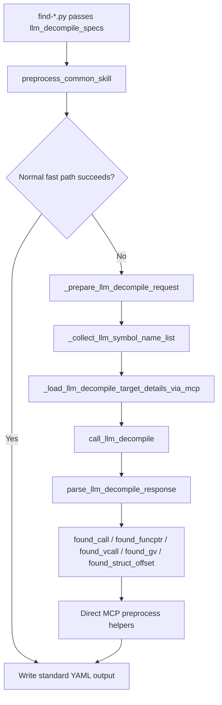

# llm_decompile

## Overview
`llm_decompile` is an LLM-assisted fallback inside `ida_analyze_util.py` that helps `preprocess_common_skill(...)` recover unresolved function, global-variable, and struct-member symbols. It prepares prompt/reference context, exports current-binary target details through MCP/IDA, asks the shared LLM transport for YAML findings, and converts those findings back into normal YAML-generation helpers.

## Responsibilities
- Validate and group `llm_decompile_specs` tuples passed by preprocessor scripts, including multi-reference grouping for the same symbol when the prompt path is consistent.
- Load prompt templates and reference YAML artifacts from `ida_preprocessor_scripts/`, resolve `{platform}` placeholders, and build per-request LLM config with retry/backoff settings.
- Resolve current-binary target function details through MCP (`py_eval`), preferring existing current-version YAML `func_va` and falling back to symbol-name lookup plus temporary JSON export.
- Render reference/target disassembly and pseudocode blocks, call the shared LLM transport, parse YAML responses, and normalize `found_vcall`, `found_call`, `found_funcptr`, `found_gv`, and `found_struct_offset`.
- Feed normalized LLM findings back into direct MCP-based preprocess helpers so the final outputs remain standard function/GV/struct YAML payloads.

## Involved Files & Symbols
- `ida_analyze_util.py` - `_build_llm_decompile_specs_map`
- `ida_analyze_util.py` - `_prepare_llm_decompile_request`
- `ida_analyze_util.py` - `_load_llm_decompile_target_func_va_from_current_yaml`
- `ida_analyze_util.py` - `_load_llm_decompile_target_detail_via_mcp`
- `ida_analyze_util.py` - `_load_llm_decompile_target_details_via_mcp`
- `ida_analyze_util.py` - `build_function_detail_export_py_eval`
- `ida_analyze_util.py` - `_export_function_detail_via_mcp`
- `ida_analyze_util.py` - `call_llm_decompile`
- `ida_analyze_util.py` - `parse_llm_decompile_response`
- `ida_analyze_util.py` - `preprocess_common_skill`
- `ida_llm_utils.py` - `call_llm_text`, `create_openai_client`, `normalize_optional_temperature`, `normalize_optional_effort`
- `ida_preprocessor_scripts/prompt/call_llm_decompile.md` - shared prompt template consumed by `_prepare_llm_decompile_request`
- `tests/test_ida_analyze_util.py` - `TestLlmDecompileSupport`

## Architecture
`llm_decompile` is not a standalone entry point. Preprocessor scripts pass `llm_decompile_specs` into `preprocess_common_skill(...)`, and the common pipeline only enters the LLM path after normal fast paths fail. Each spec is a tuple of `(symbol_name, prompt_path, reference_yaml_path)`. Duplicate symbol names are allowed only when they share the same prompt path; this lets one unresolved symbol accumulate multiple reference YAML payloads and target function names.

At request-build time, `_prepare_llm_decompile_request(...)` reads the prompt template, loads one or more reference YAML files, extracts their `func_name` values as current-binary target functions, and attaches normalized LLM transport settings. `_build_llm_decompile_request_cache_key(...)` groups compatible unresolved symbols by `(model, prompt_path, reference_yaml_paths, temperature)`, so one LLM response can be reused across multiple unresolved function/GV/struct targets that share the same request shape.

Target detail resolution is MCP-driven. `_load_llm_decompile_target_detail_via_mcp(...)` first tries `new_binary_dir/<target>.<platform>.yaml` for `func_va`; if missing, it uses `configs/<GAMEVER>.yaml` aliases plus `_find_function_addr_by_names_via_mcp(...)` to recover a unique function address. `_export_function_detail_via_mcp(...)` then runs a generated `py_eval` script that exports:
- textual disassembly gathered across function chunks and control-flow heads
- Hex-Rays pseudocode when available
- `func_name` and `func_va`

`call_llm_decompile(...)` renders `reference_blocks` and `target_blocks`, injects them into `call_llm_decompile.md`, calls the shared `ida_llm_utils.call_llm_text(...)` transport, retries transient 429/5xx-style failures with exponential backoff, and parses the YAML response with `parse_llm_decompile_response(...)`.

The normalized result is consumed back inside `preprocess_common_skill(...)`:
- `found_call` -> `_resolve_direct_call_target_via_mcp(...)` -> `_preprocess_direct_func_sig_via_mcp(...)`
- `found_funcptr` -> `_resolve_direct_funcptr_target_via_mcp(...)` -> `_preprocess_direct_func_sig_via_mcp(...)`
- `found_vcall` -> direct vcall generation or slot-only vfunc enrichment
- `found_gv` -> `_resolve_direct_gv_target_via_mcp(...)` -> `_preprocess_direct_gv_sig_via_mcp(...)`
- `found_struct_offset` -> `_preprocess_direct_struct_offset_sig_via_mcp(...)`

## Dependencies
- `ida_llm_utils.py` for OpenAI-compatible client creation, transport, temperature normalization, and effort normalization.
- `ida_preprocessor_scripts/prompt/call_llm_decompile.md` for the user prompt template.
- `ida_preprocessor_scripts/references/**/*.yaml` for reference disassembly/pseudocode payloads and target function names.
- `configs/<GAMEVER>.yaml` for symbol aliases when current-version YAML cannot supply `func_va`.
- `py_eval` MCP access to IDA APIs, plus optional Hex-Rays availability for pseudocode export.
- `PyYAML` for both reference-YAML loading and LLM response parsing.

## Notes
- The flow is fail-closed: invalid specs, missing prompt/reference files, missing `llm_config.model`, MCP export failures, YAML parse failures, or non-retryable LLM transport errors all collapse to an empty normalized result or overall preprocess failure.
- `parse_llm_decompile_response(...)` uses `yaml.BaseLoader`, so parsed scalars remain strings until downstream helpers convert them.
- Direct `found_call` and `found_funcptr` fallback is only attempted when `vfunc_sig` is not required; vfunc-oriented targets rely on `found_vcall` or the slot-only enrichment path.
- The direct target resolvers require exactly one match from `CodeRefsFrom(...)` or `DataRefsFrom(...)`; ambiguous matches are rejected instead of guessed.
- Request batching assumes one `preprocess_common_skill(...)` invocation shares a stable platform/LLM config. The cache key currently includes model, prompt path, reference YAML paths, and temperature, but not symbol name.
- In multi-target batches, `call_llm_decompile(...)` receives full `target_blocks` for every grouped target, but the scalar `disasm_code` and `procedure` arguments are taken from the first resolved target detail.

## Agent Skill fallback pointer: CEntitySystem_m_entityNames
- Trigger signal: `find-CEntitySystem_m_entityNames` cannot find the expected `sub_*(this + off + 8, this + off, &key)` call after a game update.
- Root cause / constraint: the ordered-map/RB-tree lookup helper may be inlined into `CEntitySystem_AddEntityToNameMap`; anonymous helper names and fixed decompiler call shapes are not stable.
- Correct practice: use `.claude/skills/find-CEntitySystem_m_entityNames/SKILL.md`, anchor on the entity-name key plus RB-tree field cluster, and derive the common `this + off` across inline/de-inline boundaries.
- Validation: run `uv run ida_analyze_bin.py -gamever <gamever> -oldgamever none -modules=server -debug -skip_pp -skill=find-CEntitySystem_m_entityNames` and require `Failed: 0` with a non-empty platform YAML.
- Scope: struct-member recovery for `CEntitySystem::m_entityNames`; the same semantic-anchor pattern generalizes to other fragile LLM_DECOMPILE finders.

## Callers
- `ida_preprocessor_scripts/find-CBaseEntity_OnTakeDamage.py` - passes a single-symbol `LLM_DECOMPILE` spec plus `func_vtable_relations` to recover a vfunc-style target.
- `ida_preprocessor_scripts/find-CEntityInstance_Disconnect-AND-CEntityComponentHelperT_Free.py` - passes two symbols that share the same prompt/reference pair, exercising batch reuse.
- `tests/test_ida_analyze_util.py` - `TestLlmDecompileSupport` covers response normalization, request preparation, retry behavior, batching, and the function/GV/struct fallback branches.