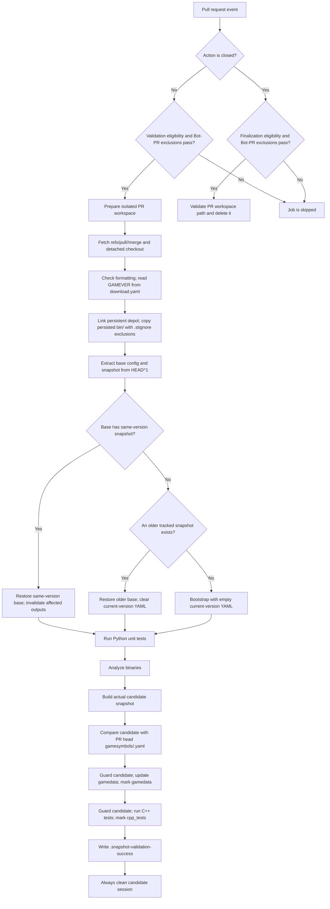

# pr-self-runner

## Overview
`.github/workflows/pr-self-runner.yml` 是同仓库 PR 的确定性验证流水线：它在隔离的 Windows self-hosted 工作区检出 GitHub 生成的 PR merge ref，从持久化二进制缓存恢复确定性基线，只重建受影响结果，并验证 PR 提交的 canonical game-symbol snapshot 与实际分析结果完全一致。PR 关闭时由独立 job 安全删除该 PR 工作区。

## Responsibilities
- 监听 PR 打开、更新、重新打开、转为 ready 和关闭事件，并按 PR 编号串行化/取消过期运行。
- 只验证受信任仓库中的同仓库 PR，拒绝 fork PR，并跳过特定的自动 `bump-download` manifest PR 与 build workflow 创建的 `gamesymbols/<GAMEVER>` snapshot/gamedata 输出 PR。
- 为每个 PR 创建独立工作区，检出 `refs/pull/<PR>/merge`，验证合并结果而非单独 head commit。
- 从持久化缓存复制目标版本二进制，并从 merge commit 的第一父提交提取确定性 base config/snapshot。
- 同版本变更时只失效受影响的输出；新版本或 bootstrap 场景按边界恢复旧 snapshot 或清空当前版本 YAML。
- 运行 Python 单元测试、IDA 分析，构建实际候选 snapshot，并与 PR head 中的 `gamesymbols/<GAMEVER>.yaml` 比较。
- 让 gamedata 更新与 C++ 测试只消费实际候选，成功后写入验证标记，但不 publish snapshot、也不回写持久化 YAML。
- PR 关闭时检查路径边界与 reparse point，再删除隔离工作区。

## Involved Files & Symbols
- `.github/workflows/pr-self-runner.yml` - workflow `PR Self Runner Validation`
- `.github/workflows/pr-self-runner.yml` - job `validate`
- `.github/workflows/pr-self-runner.yml` - job `finalize-pr-workspace`
- `download.yaml` - 最后一项 `downloads[-1].tag` 决定 `GAMEVER`
- `configs/<GAMEVER>.yaml` - PR head 分析配置
- `gamesymbols/<GAMEVER>.yaml` - PR head 的 expected canonical snapshot
- `gamesymbol_snapshot.py` - `restore` 确定性 base snapshot
- `gamesymbol_pr_validation.py` - `invalidate` 同版本受影响输出
- `gamesymbol_candidate.py` - `build` / `compare` / `guard` / `mark`
- `ida_analyze_bin.py` - 基于恢复/失效后的工作区执行分析
- `gamedata_candidate.py` - 从实际候选在隔离目录生成并 guard 版本化 gamedata
- `run_cpp_tests.py` - 从实际候选执行 C++ 编译与布局验证
- `PERSISTED_WORKSPACE/bin/.stignore` - robocopy 的简单文件/目录排除规则
- `tests/test_pr_self_runner_workflow.py` - 触发条件、顺序、候选边界和关闭清理约束测试

## Architecture
大致流程：

1. workflow 监听 `opened`、`synchronize`、`reopened`、`ready_for_review`、`closed`；同一 repository + PR number 只保留最新运行。
2. 非 closed 事件进入 `validate`。条件要求仓库在白名单、PR head 来自当前仓库，并排除两类 GitHub Actions bot PR：`bump-download/*` + `chore(download): Update manifest for `，以及 build workflow 创建、同时包含 validated snapshot 与生成 gamedata 的 `gamesymbols/*` + `chore(gamesymbols): add ` 输出 PR。相同排除条件也应用于 closed 事件的 `finalize-pr-workspace`。
3. 在 `RUNNER_WORKSPACE/CS2_VibeSignatures-pr-<PR>` 创建隔离目录；每次验证先删除旧目录，再初始化 Git 仓库、抓取并 detached checkout `refs/pull/<PR>/merge`，同时初始化 submodules。
4. 执行格式检查，并从 PR merge 结果的 `download.yaml` 最后一项读取 `GAMEVER`。
5. 将 `cs2_depot` 链接到持久化 depot；要求 `PERSISTED_WORKSPACE/bin/<GAMEVER>` 已存在，按 `.stignore` 排除规则复制到真实的 PR 工作区 `bin`。本 workflow 不负责下载缺失二进制。
6. 以 `HEAD^1` 作为 PR base parent，提取 base `configs/<GAMEVER>.yaml`。若 base 已有同版本 snapshot，则直接提取；否则寻找 base 中排序后的最后一个 tracked snapshot，并使用其发布 commit 对应的 config；若完全没有 snapshot，则进入 bootstrap。
7. 有 base snapshot 时先 `restore`。同版本场景运行 `invalidate`，依据 base/head config、snapshot 与 Git refs 只失效受影响结果；新版本场景保留旧版本结果供 signature 复用，但清空当前版本全部 YAML；bootstrap 场景直接从空的当前版本 YAML 开始重建。
8. 运行 Python unit tests，再执行 IDA 分析。
9. 在 `RUNNER_TEMP` 构建实际候选 snapshot，并与 PR head 的 `gamesymbols/<GAMEVER>.yaml` 比较；不一致即失败。
10. 对实际候选依次执行 guard、gamedata 更新、mark，以及 guard、C++ 测试、mark。成功后在 PR 工作区写入 `.snapshot-validation-success`。
11. 每次验证都用 `always()` 清理临时候选 session；PR 工作区保留到下一次验证重建或 PR closed。
12. closed 事件只进入 `finalize-pr-workspace`：验证目标目录名、根路径和非 reparse point 后，先离开该目录再递归删除。合并 PR 的工作区若缺失会报错；未合并且已无目录则安全 no-op。

## Dependencies
- GitHub Actions `win64` environment，以及标签为 `self-hosted`, `windows`, `x64` 的 runner。
- GitHub PR merge ref：`refs/pull/<PR>/merge`；workflow 仅有 `contents: read` 权限。
- Secrets：必须有 `PERSISTED_WORKSPACE`；IDA 分析使用 `CS2VIBE_AGENT` 与 LLM 配置。Steam secrets 虽配置在 env 中，但当前 PR 流程没有 depot 下载步骤。
- 持久化资源：`PERSISTED_WORKSPACE/cs2_depot`、`PERSISTED_WORKSPACE/bin/<GAMEVER>`、`PERSISTED_WORKSPACE/bin/.stignore`。
- 工具链：PowerShell、`git`、`robocopy`、`mklink`、`uv`、Python、IDA / idalib-mcp、LLM agent、Clang/C++。
- 仓库数据：base/head `configs/<GAMEVER>.yaml`、`download.yaml`、base/head `gamesymbols/*.yaml`、submodules。
- 相关 Serena memory：`mem:ida_analyze_bin`、`mem:update_gamedata`、`mem:run_cpp_tests`。

## Notes
- concurrency group 为 `pr-self-runner-<repository>-<PR number>`，且 `cancel-in-progress: true`；同一 PR 的旧验证会被新提交取消。
- fork PR 被跳过，因为流程需要受保护 secrets 和 self-hosted runner；特定 bot `bump-download/*` manifest PR，以及 build workflow 创建的 `gamesymbols/*` snapshot/gamedata 输出 PR，都会被 `validate` 与 `finalize-pr-workspace` 显式跳过。过滤器同时校验 Bot 身份、head 分支前缀和标题前缀，避免误伤普通人工 PR。
- workflow 验证的是 GitHub 合成的 merge commit；`HEAD^1` 被当作 base parent，当前 `HEAD` 是合并结果。
- PR 流程不会下载 depot；如果持久化 `bin/<GAMEVER>` 不存在，验证直接失败。因此正式 build/cache 准备是新版本 PR 验证的外部前置条件。
- `.stignore` 解析只接受扁平文件名或目录名；注释、空行和否定规则被忽略，包含嵌套路径的 pattern 会被拒绝。
- 实际候选是 compare、gamedata 和 C++ tests 的唯一 symbol source。PR workflow 不调用 `gamesymbol_candidate.py publish`，也不会把 PR 产生的 YAML 写回 `PERSISTED_WORKSPACE`。
- PR head 必须包含与实际分析结果一致的 `gamesymbols/<GAMEVER>.yaml`；compare 失败会阻止后续验证。
- `.snapshot-validation-success` 只在 C++ 测试成功后写入；当前 workflow 内不再读取该标记，它用于表明保留工作区已完成全链路验证。
- 新版本分支会恢复旧 snapshot 以允许旧 signature 复用，但会删除当前版本目录下所有 YAML，避免把持久化缓存中的当前版本中间结果当作可信输入。
- closed 事件不会运行 `validate`；它只运行清理 job。合并 PR 缺少预期工作区被视为异常，普通关闭且目录已不存在则不报错。

## Callers
- GitHub pull request actions：`opened`、`synchronize`、`reopened`、`ready_for_review`、`closed`
