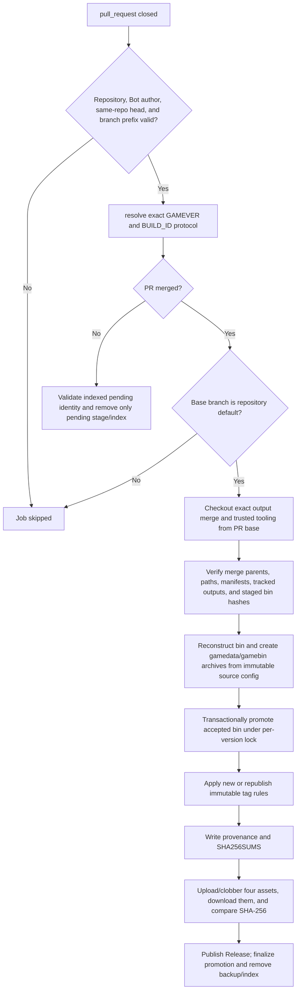

# promote-release-after-output-merge

## Overview
`.github/workflows/promote-release-after-output-merge.yml` 是 generated-output PR 的合并后发布门：PR 未合并时仅清理与该 PR 精确绑定的 pending staging；PR 合并到默认分支后，才验证 provenance、重建归档、事务性接纳 bin、执行 immutable tag 规则并发布 GitHub Release。它将“代码审查接受输出”作为公开 Release 与持久化 bin 生效的前置条件，并把 source/output/tag/asset hashes 写入 provenance。

## Responsibilities
- 监听 generated-output PR 的 `pull_request.closed` 事件，并只接受 allowlisted repository、`github-actions[bot]` 作者、同仓库 head 与 `gamesymbols/build/` 分支协议。
- 从 `gamesymbols/build/<GAMEVER>/<RUN_ID>-<RUN_ATTEMPT>` 精确解析 `gamever`，作为同版本 cleanup/promotion 的 concurrency identity。
- 对未合并 PR，验证 PR index、head SHA、private manifest 与 `READY` marker 后，只删除对应 pending stage 和 PR index。
- 对已合并 PR，校验两父 merge commit、SOURCE_SHA/PR head parent 顺序、允许的输出路径、tracked/private manifest 一致性以及 staged bin inventory/hash。
- 从 accepted output merge 与 staged bin 重建 release workspace，并使用 manifest 中 immutable `source_sha` 的 versioned config 生成 `gamedata-<GAMEVER>.7z` 与 `gamebin-<GAMEVER>.7z`。
- 在 per-version lock 下事务性替换 `PERSISTED_WORKSPACE/bin/<GAMEVER>`，保留旧目录 backup 直到远端 Release assets 完整上传并回下载 hash 验证成功。
- 对 `new` 与 `republish` 应用不可变 tag 语义，生成 provenance/checksum，发布或替换 Release assets，最后写 completion marker 并清理 recovery backup/index。

## Involved Files & Symbols
- `.github/workflows/promote-release-after-output-merge.yml` - workflow `Promote Release After Output Merge`
- `.github/workflows/promote-release-after-output-merge.yml` - jobs `resolve`, `cleanup-unmerged`, `promote`
- `.github/workflows/build-on-self-runner.yml` - 创建 immutable output branch/PR，调用 `stage-build`, `finalize-stage`, `write-pr-index`
- `.github/workflows/validate-generated-output-pr.yml` - 合并前调用 trusted `verify-output-pr` 做路径、provenance 与 tracked hash 轻量校验
- `.github/workflows/abandon-staged-release.yml` - promotion 触碰 accepted bin 前失败时的显式恢复入口
- `release_workflow.py` - staged release lifecycle CLI wrapper
- `release_workflow_lib/cli.py` - `_run_verification`, `_run_promotion`
- `release_workflow_lib/promotion.py` - `verify_promotion`, `reconstruct_workspace`, `promote_bin`, `finalize_promotion`
- `release_workflow_lib/staging.py` - `load_indexed_pending`, `cleanup_unmerged`, `_remove_indexed_pending`
- `release_workflow_lib/manifests.py` - `load_tracked_manifest`, `verify_tracked_outputs`, `write_release_metadata`
- `release-manifests/<GAMEVER>.json` - tracked release identity、source/config/candidate/bin/output hashes
- `tests/test_build_self_runner_workflow.py` - event/branch contract、trusted tooling 与 publication ordering 回归测试
- `tests/test_release_workflow.py` - staging identity、tamper/reparse guards、transactional swap 与幂等性测试

## Architecture
上游 `build-on-self-runner.yml` 完成候选验证后，将 tracked outputs 和 release manifest 提交到 immutable output branch，同时把 bin/private manifest 保存在 `PERSISTED_WORKSPACE/release-staging/<GAMEVER>/<BUILD_ID>`，再以 PR number 写入 `pr-index`。本 workflow 不重新分析二进制，而是在 PR close 时把该 GitHub event、Git merge topology、tracked manifest 和私有 staging 四方身份重新绑定。

`resolve` 在 GitHub-hosted Ubuntu runner 上执行轻量分支解析；`cleanup-unmerged` 与 `promote` 使用相同的 `release-promotion-<repository>-<gamever>` concurrency group、`cancel-in-progress: false`，并在 `win64` environment 的 Windows self-hosted runner 上串行访问持久化状态。

`promote` 先检出精确 `merge_commit_sha`，再把 PR base SHA 单独检出到 `.release-tools`；所有授权校验和状态变更命令都由 base 版本的 trusted `release_workflow.py` 执行。验证成功后的顺序固定为：reconstruct → archive → promote accepted bin → tag → provenance/checksum → Release upload/download hash verification → finalize。只有最后一步才写 `PROMOTION_COMPLETE`、删除旧 bin backup 和 PR index。

## Dependencies
- GitHub Actions event `pull_request.closed`；workflow permissions 为 `contents: write` 与 `pull-requests: read`。
- GitHub-hosted `ubuntu-latest` resolve runner，以及受 `win64` environment 保护的 `[self-hosted, windows, x64]` runner。
- Secret `PERSISTED_WORKSPACE`；核心状态位于 `release-staging/<GAMEVER>/<BUILD_ID>`、`release-staging/pr-index/<PR>.json`、`release-staging/locks/<GAMEVER>.lock` 与 `bin/<GAMEVER>`。
- 工具链：`actions/checkout@v4`、PowerShell、`uv`/Python、Git、7-Zip、GitHub CLI `gh`。
- 仓库资源：`configs/<GAMEVER>.yaml`、`gamesymbols/<GAMEVER>.yaml`、`dist/`、`hl2sdk_cs2` submodule、`release-manifests/<GAMEVER>.json` 与 staged `bin/<GAMEVER>`。
- 上游生成与 staging 协议见 `mem:build-on-self-runner`；普通 PR self-runner 会跳过这类 Bot output PR，边界见 `mem:pr-self-runner`。

## Notes
- Branch 只先用 prefix 过滤，随后由 `resolve` 与 Python library 强制完整格式：`gamesymbols/build/<4-10位数字且可带单字母后缀>/<数字>-<数字>`。
- 允许的 repository 固定为 `HLND2T/CS2_VibeSignatures` 与 `hzqst/CS2_VibeSignatures`；fork、人工创建的 PR、非默认分支合并都不会进入 promotion。
- Trusted tooling 与待发布数据分离：merge checkout 提供 accepted outputs，PR base checkout 提供校验/变更逻辑，避免执行 output PR 中可能被修改的发布代码。
- `verify_promotion` 要求 merge commit 恰有两个 parent，第一 parent 等于 staged `source_sha`，第二 parent 等于 indexed PR head SHA；默认分支在构建后发生漂移会导致 promotion 拒绝。
- 归档时会临时用 `git show <source_sha>:configs/<GAMEVER>.yaml` 覆盖当前 config，验证 `analysis_config_sha256` 后打包，并在 `finally` 中恢复或删除临时 config。
- `new` 模式只在 tag 不存在时创建 lightweight tag；若已存在则必须指向当前 output merge。 `republish` 要求 tag 与 Release 已存在，并且绝不移动 tag。
- Release assets 固定为两个 7z、`release-provenance-<GAMEVER>.json` 与 `SHA256SUMS-<GAMEVER>.txt`；上传使用 `--clobber`，全部回下载并验证 SHA-256 后才解除 draft/完成 promotion。
- `promote-bin` 在写 `PROMOTION_STARTED` 后执行 incoming/backup swap；目标 inventory 已相同时可幂等成功。上传或最终化失败会保留 staging、PR index 和必要的 backup 供重跑。
- 未合并 cleanup 在 PR index 不存在时安全 no-op；存在时必须通过 event head SHA、private manifest 和 `READY` hash 绑定后才删除，且不会触碰 accepted `bin/<GAMEVER>`。
- 显式 abandon 只适用于 promotion 尚未触碰 accepted bin 的失败；一旦存在 promotion state marker，应重跑原 promotion workflow 完成恢复，而不是手工删除状态。

## Callers
- GitHub `pull_request.closed`：关闭或合并符合 generated-output branch protocol 的同仓库 Bot PR。
- `.github/workflows/build-on-self-runner.yml` 创建并索引该 PR；维护者的 merge/close 操作间接触发本 workflow。
