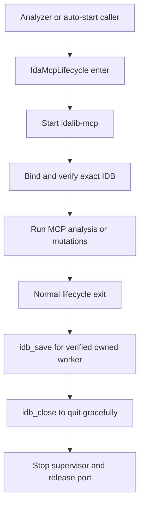

# idalib-mcp

## Overview

`idalib-mcp` is the repository-owned IDA runtime for one binary at a time. `IdaMcpLifecycle` starts, validates, saves, and closes the worker so an analysis task never binds an arbitrary or stale IDB.

## Responsibilities

- Start one owned `idalib-mcp` supervisor for the exact requested binary and wait for the MCP contract.
- Bind the unique active database, validate its path, platform metadata, architecture, and original-input hash.
- On successful lifecycle exit, save the verified owned IDB with `idb_save`, then request targeted `qexit`, stop the supervisor, and wait for port release.
- Fail closed for an existing IDB lock, occupied MCP port, ambiguous database, stale/mismatched IDB, or a failed explicit save.

## Involved Files & Symbols

- `ida_analyze_bin.py` - `IdaMcpLifecycle`, `save_ida_database_via_mcp`, `quit_ida_gracefully`
- `ida_mcp_session.py` - `open_ida_mcp_session`, `McpDatabaseBinding.should_auto_quit`
- `generate_reference_yaml.py` - `autostart_mcp_session` for the reference-YAML CLI
- `tests/test_ida_analyze_bin.py` - owned-save and graceful-shutdown contract tests
- `tests/test_ida_mcp_session.py` - `McpDatabaseBinding.should_auto_quit` and owned-selection behavior tests

## Architecture

## Dependencies

- Local `idalib-mcp` executable on `127.0.0.1:13337`.
- IDA MCP tools including `idb_list`, `survey_binary`, `idb_save`, and `py_eval`.
- The target binary and its IDB side files; `.id0` denotes an active IDB lock.

## Notes

- Auto-save and automatic close apply only when `auto_started && owned && backend == "worker"`; an attached external database must never be saved or closed by this lifecycle.
- Call `idb_close` to release a worker eagerly.
- `idb_save` runs only on normal `IdaMcpLifecycle.__exit__`. If it fails, cleanup still performs graceful shutdown, then the lifecycle reports failure.
- Keep Windows and Linux work sequential because they share one host and port. Do not start a second lifecycle when the port is occupied.
- Perform all IDB mutations inside the owned lifecycle. After validation, call `server_health`, then let normal lifecycle exit save and close the IDB. Verify the final IDB path and modification time after that exit; use manual `idb_save` only for an intermediate checkpoint.
- Do not create a pre-mutation backup IDB unless the user explicitly requests one.

## Callers

- `ida_analyze_bin.analyze` creates one lifecycle for each pending module/platform binary.
- `generate_reference_yaml.autostart_mcp_session` creates the same lifecycle for `-auto_start_mcp`.

## Source

Synced from `D:\GoldSrc_VibeSignatures\memory\idalib-mcp.md` ([[goldsrc-vibesignatures/idalib-mcp]]).
